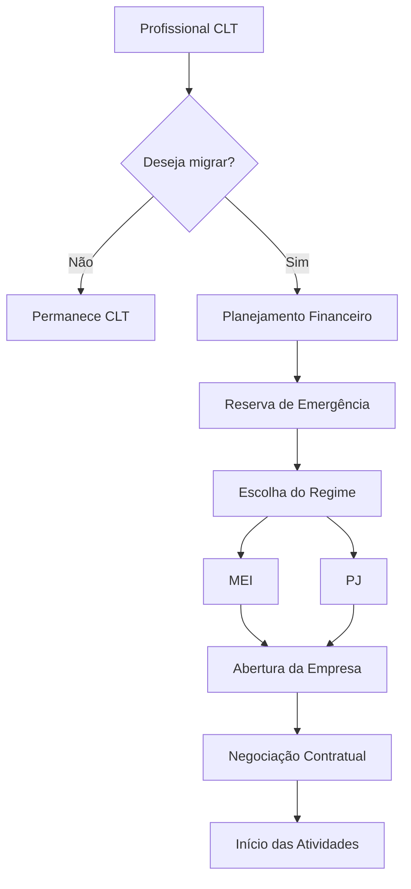

# 📘 Orientador de Migração de Carreira: CLT para PJ e/ou MEI


> Projeto desenvolvido como parte do desafio prático da **DIO**, utilizando o **NotebookLM** como ferramenta de apoio ao estudo, curadoria de conhecimento e documentação técnica.

---

## 📑 Índice

- [📖 Sobre o Projeto](#-sobre-o-projeto)
- [🎯 Objetivos](#-objetivos)
- [🚀 Competências Desenvolvidas](#-competências-desenvolvidas)
- [🏆 Resultados Obtidos](#-resultados-obtidos)
- [🗓️ Linha do Tempo](#️-linha-do-tempo)
- [📚 Curadoria de Fontes](#-curadoria-de-fontes)
- [🔄 Fluxo do NotebookLM](#-fluxo-do-notebooklm)
- [🧠 Engenharia de Prompts](#-engenharia-de-prompts)
- [⚠️ Cicatrizes e Aprendizados](#️-cicatrizes-e-aprendizados)
- [📖 Miniguia de Estudo](#-miniguia-de-estudo)
- [🔀 Fluxograma da Migração CLT → PJ → MEI](#-fluxograma-clt--pj--mei)
- [📚 Glossário](#-glossário)
- [🤖 Prompts Reutilizáveis](#-prompts-reutilizáveis)
- [💭 Considerações Finais](#-considerações-finais)
- [🚀 Próximos Passos](#-próximos-passos)
- [📂 Estrutura do Repositório](#-estrutura-do-repositório)
- [🛠️ Tecnologias Utilizadas](#️-tecnologias-utilizadas)
- [👨‍💻 Sobre o Autor](#-sobre-o-autor)
- [📄 Licença](#-licença)
- [🙏 Agradecimentos](#-agradecimentos)

---

# 📖 Sobre o Projeto

Este projeto foi desenvolvido durante o bootcamp da **DIO** com o objetivo de aplicar os conhecimentos de **Inteligência Artificial Generativa** utilizando o **NotebookLM** como ferramenta de pesquisa, organização de conhecimento e construção de materiais técnicos.

O tema escolhido foi:

# **Orientador de Migração de Carreira: CLT para PJ e/ou MEI**

A mudança do regime de contratação é uma decisão que envolve aspectos financeiros, tributários, jurídicos e estratégicos.

Por esse motivo, este projeto reúne informações provenientes de fontes oficiais para apoiar profissionais que desejam compreender melhor as diferenças entre os regimes **CLT**, **Pessoa Jurídica (PJ)** e **Microempreendedor Individual (MEI)**.

Mais do que comparar modelos de contratação, o estudo busca desenvolver senso crítico na interpretação das informações geradas por Inteligência Artificial, reforçando a importância da validação em fontes oficiais.

---

# 🎯 Objetivos

Este projeto possui os seguintes objetivos:

- compreender as diferenças entre CLT, PJ e MEI;
- estudar os principais aspectos tributários envolvidos na migração;
- entender o funcionamento do Simples Nacional e do Fator R;
- aprender como calcular o valor da hora trabalhada como PJ;
- identificar custos que normalmente não são considerados durante uma negociação;
- compreender como negociar contratos de prestação de serviços;
- conhecer obrigações fiscais do MEI;
- estudar planejamento financeiro para uma migração segura;
- praticar Engenharia de Prompts utilizando o NotebookLM;
- documentar todo o processo em um repositório GitHub.

---

# 🚀 Competências Desenvolvidas

Durante a construção deste projeto foram exercitadas competências como:

| Competência           | Aplicada |
| --------------------- | :------: |
| NotebookLM            |     ✅    |
| IA Generativa         |     ✅    |
| Engenharia de Prompts |     ✅    |
| Curadoria de Fontes   |     ✅    |
| Markdown              |     ✅    |
| GitHub                |     ✅    |
| Pesquisa Técnica      |     ✅    |
| Documentação          |     ✅    |
| Pensamento Crítico    |     ✅    |

---

## 🎯 Resultados Obtidos

Ao final deste projeto foi possível:

- compreender diferenças entre CLT, PJ e MEI;
- analisar impactos tributários;
- aprender o funcionamento do Fator R;
- calcular remuneração PJ equivalente à CLT;
- desenvolver habilidades em Engenharia de Prompts;
- utilizar o NotebookLM como ferramenta de estudo;
- produzir documentação técnica em Markdown para o GitHub.

---

# 🗓️ Linha do Tempo

```text
Escolha do tema
        │
        ▼
Pesquisa das fontes
        │
        ▼
NotebookLM
        │
        ▼
Testes de Prompts
        │
        ▼
Refinamento
        │
        ▼
Miniguia
        │
        ▼
README GitHub
```

---

# 📚 Curadoria de Fontes

Para garantir maior confiabilidade nas respostas geradas pelo NotebookLM, foram utilizadas exclusivamente fontes oficiais ou amplamente reconhecidas.

Essa abordagem reduz o risco de interpretações incorretas sobre legislação, tributação e obrigações fiscais.

## Fonte 1

### Portal do Empreendedor

Conteúdo oficial sobre:

- abertura do MEI;
- obrigações;
- faturamento;
- emissão de notas fiscais;
- direitos e deveres.

https://www.gov.br/empresas-e-negocios/pt-br/empreendedor

---

## Fonte 2

### Receita Federal

Utilizada para consulta sobre:

- Imposto de Renda;
- Simples Nacional;
- CNPJ;
- tributação;
- tabelas oficiais;
- obrigações fiscais.

https://www.gov.br/receitafederal

---

## Fonte 3

### Tributação de 2026 — Tabelas do Imposto de Renda (IRPF)

Fonte oficial da Receita Federal utilizada para consulta das tabelas de incidência, deduções e regras de cálculo do Imposto de Renda da Pessoa Física (IRPF).

Essa referência foi incorporada ao projeto para complementar os estudos sobre tributação, possibilitando respostas mais precisas sobre faixas de incidência, deduções e impactos financeiros na comparação entre os regimes CLT e PJ.

https://www.gov.br/receitafederal/pt-br/assuntos/meu-imposto-de-renda/tabelas/2026

---

## Fonte 4

### Sebrae

Fonte utilizada para:

- planejamento financeiro;
- precificação;
- abertura de empresa;
- empreendedorismo;
- migração de carreira;
- gestão empresarial.

https://sebrae.com.br

---

## Fonte 5

### eSocial

Fonte oficial utilizada para compreender:

- direitos trabalhistas;
- obrigações do empregador;
- funcionamento do regime CLT;
- relações trabalhistas.

https://www.gov.br/esocial

---

## Fonte 6

### Lei Complementar nº 123/2006

Principal legislação referente ao:

- Simples Nacional;
- MEI;
- Microempresa;
- Empresa de Pequeno Porte;
- enquadramento tributário.

https://www.planalto.gov.br/ccivil_03/leis/lcp/lcp123.htm

---

# 🎓 Por que utilizar fontes oficiais?

Durante o desenvolvimento do projeto ficou evidente que conteúdos tributários podem sofrer alterações frequentes.

Além disso, respostas produzidas por modelos de IA podem simplificar regras complexas ou deixar de considerar exceções previstas na legislação.

Por esse motivo, sempre que possível foram priorizadas fontes governamentais, garantindo maior segurança na interpretação das informações.

Essa estratégia também demonstrou uma das principais vantagens do NotebookLM: limitar as respostas ao conjunto de documentos previamente selecionados, reduzindo significativamente o risco de alucinações da IA.

---

# 🔄 Fluxo do NotebookLM


---

# 🧠 Introdução à Engenharia de Prompts

Após selecionar as fontes, iniciou-se a etapa de exploração do NotebookLM utilizando diferentes estratégias de prompts.

O objetivo não era apenas obter respostas, mas compreender como pequenas mudanças na formulação das perguntas influenciam diretamente a qualidade dos resultados.

Durante o processo, foram realizados testes com diferentes níveis de detalhamento, restrições de contexto e solicitações de exemplos práticos.

Esses experimentos permitiram identificar boas práticas para construção de prompts mais precisos, além de evidenciar situações em que foi necessário complementar as fontes para obter respostas mais completas.

---

# 🧠 Engenharia de Prompts

Um dos principais objetivos deste projeto foi explorar o potencial do NotebookLM por meio da Engenharia de Prompts, utilizando perguntas estrategicamente elaboradas para extrair respostas contextualizadas, fundamentadas nas fontes adicionadas ao caderno.

Durante o estudo, diferentes abordagens foram testadas para compreender como a qualidade dos prompts influencia diretamente a precisão, profundidade e confiabilidade das respostas geradas pela IA.

Além de buscar informações, houve uma preocupação constante em validar os resultados, comparar interpretações e identificar limitações da ferramenta, especialmente em temas relacionados à legislação e tributação.

---

## 🎯 Objetivos dos Prompts

Os prompts foram elaborados para responder às seguintes questões:

- Quais são as principais diferenças entre CLT, PJ e MEI?
- Quais áreas oferecem melhores oportunidades para atuação como PJ?
- Como funciona o Fator R e qual seu impacto na tributação?
- Quais são as principais mudanças previstas para o MEI em 2027?
- Como calcular uma remuneração PJ equivalente ao salário recebido como CLT?

Cada pergunta buscou explorar um aspecto específico da migração de carreira, permitindo construir uma visão ampla sobre planejamento financeiro, tributação, negociação e formalização profissional.

---

# 💬 Prompts Utilizados

## Prompt 1 — Comparação entre CLT, PJ e MEI

**Prompt:**

> Com base exclusivamente nas fontes adicionadas, explique as diferenças entre CLT, PJ e MEI, apresentando vantagens, desvantagens e situações em que cada regime é mais indicado.

### Objetivo

Compreender as características de cada modelo de contratação, identificando cenários em que cada um pode ser mais adequado.

### Resultado Obtido

A resposta apresentou uma comparação estruturada entre os três regimes, destacando aspectos como vínculo empregatício, tributação, benefícios, autonomia profissional e responsabilidades fiscais.

---

## Prompt 2 — Áreas com maior potencial para atuação como PJ

**Prompt:**

> Quais áreas mais interessantes para atuar como PJ?

### Objetivo

Identificar segmentos do mercado com maior demanda por profissionais contratados como Pessoa Jurídica.

### Resultado Obtido

Foram apresentadas áreas como:

- Tecnologia da Informação;
- Consultoria;
- Engenharia;
- Marketing;
- Saúde;
- Arquitetura;
- Design;
- Serviços especializados.

Além da lista, a IA explicou os fatores que tornam esses setores mais propensos à contratação de profissionais PJ.

---

## Prompt 3 — Explicação sobre o Fator R

**Prompt:**

> Com base exclusivamente nas fontes adicionadas, explique o Fator R em apenas dois parágrafos e apresente um exemplo prático.

### Objetivo

Compreender como o Fator R influencia o enquadramento tributário de empresas optantes pelo Simples Nacional.

### Resultado Obtido

A resposta apresentou uma explicação objetiva sobre o cálculo do Fator R e demonstrou, por meio de um exemplo prático, como a relação entre folha de pagamento e faturamento pode alterar a alíquota tributária aplicada.

---

## Prompt 4 — Mudanças previstas para o MEI

**Prompt:**

> Apresente um comparativo com as principais mudanças da nova regra de faturamento do MEI para 2027.

### Objetivo

Identificar alterações relevantes na legislação relacionadas ao limite de faturamento e às obrigações do Microempreendedor Individual.

### Resultado Obtido

O NotebookLM apresentou um resumo comparativo entre as regras vigentes e as alterações previstas nas fontes consultadas, permitindo compreender os possíveis impactos para futuros empreendedores.

---

## Prompt 5 — Simulação Financeira

**Prompt:**

> Em uma migração para PJ, qual a pedida salarial ideal para um profissional de TI que recebe R$ 15.000 como CLT manter os mesmos ganhos? Apresente o resultado em uma planilha comparativa.

### Objetivo

Simular uma negociação salarial considerando benefícios perdidos, carga tributária, férias, décimo terceiro salário, reserva financeira e demais custos envolvidos na migração.

### Resultado Obtido

Foi gerada uma comparação financeira entre os regimes CLT e PJ, demonstrando que a remuneração nominal como PJ nem sempre representa ganho real, sendo necessário considerar diversos fatores além do salário mensal.

---

# ⚠️ Cicatrizes e Aprendizados

Ao longo do desenvolvimento do projeto, algumas limitações foram identificadas durante a utilização do NotebookLM.

Essas dificuldades contribuíram para aprimorar os prompts e reforçaram a importância da seleção criteriosa das fontes utilizadas.

---

## Problema Encontrado

Durante uma das consultas sobre tributação, a IA apresentou apenas uma visão superficial dos impostos aplicáveis aos diferentes regimes.

Embora os tributos fossem corretamente citados, não houve detalhamento das faixas de incidência, regras de cálculo ou impactos financeiros para diferentes cenários.

Como consequência, a resposta não permitia compreender claramente os benefícios e limitações de cada regime tributário.

---

### Como o problema foi resolvido

Para aumentar a precisão das respostas, foi adicionada ao NotebookLM uma fonte oficial da Receita Federal contendo as tabelas de incidência e deduções para cálculo do Imposto sobre a Renda da Pessoa Física (IRPF).

Com essa atualização, o NotebookLM passou a responder de forma mais completa, apresentando não apenas os tributos incidentes, mas também as respectivas faixas de tributação, deduções aplicáveis e exemplos de cálculo, reduzindo interpretações genéricas e aumentando a confiabilidade das respostas.

Esse refinamento reforçou a importância de complementar o conjunto de fontes sempre que forem identificadas lacunas nas respostas geradas pela IA.

---

# 💡 Principais Aprendizados sobre Engenharia de Prompts

Durante a construção deste projeto, algumas boas práticas tornaram-se evidentes:

- fornecer contexto claro antes da pergunta;
- limitar as respostas às fontes adicionadas ao NotebookLM;
- solicitar exemplos práticos para facilitar a compreensão;
- especificar o formato esperado da resposta (listas, tabelas ou resumos);
- solicitar comparações entre cenários quando necessário;
- evitar perguntas excessivamente genéricas;
- complementar o caderno com novas fontes sempre que identificadas lacunas nas respostas.

Essas práticas resultaram em respostas mais úteis, organizadas e confiáveis.

---

# 📚 Lições Aprendidas

O principal aprendizado obtido durante a utilização do NotebookLM foi que a confiabilidade das respostas está diretamente relacionada à qualidade das fontes adicionadas ao projeto.

Em temas complexos, como legislação tributária, utilizar documentos oficiais é essencial para evitar interpretações equivocadas ou informações desatualizadas.

Também ficou evidente que modelos de IA devem ser utilizados como ferramentas de apoio à análise, e não como fonte única de decisão.

O processo de revisar respostas, complementar fontes e refinar prompts mostrou-se tão importante quanto a obtenção da resposta inicial.

Essa experiência reforçou a importância do pensamento crítico no uso da Inteligência Artificial aplicada ao aprendizado e à tomada de decisão.

---

# 📖 Miniguia de Estudo

Este miniguia reúne os principais conceitos estudados durante o desenvolvimento do projeto, servindo como material de consulta rápida para profissionais que desejam compreender os impactos da migração do regime CLT para PJ ou MEI.

O conteúdo foi elaborado com base nas fontes oficiais adicionadas ao NotebookLM e consolidado após validação crítica das respostas geradas pela IA.

---

# 📚 Resumo Estruturado

## O que significa migrar de CLT para PJ ou MEI?

Migrar do regime CLT para atuar como Pessoa Jurídica (PJ) ou Microempreendedor Individual (MEI) significa deixar de possuir vínculo empregatício formal para prestar serviços por meio de uma empresa.

Essa mudança pode proporcionar maior autonomia profissional, possibilidades de otimização tributária e potencial de aumento da remuneração. Por outro lado, transfere ao profissional responsabilidades relacionadas à gestão financeira, tributária, previdenciária e contratual.

A decisão deve considerar não apenas a remuneração oferecida, mas também os benefícios perdidos, os riscos envolvidos e os objetivos profissionais de longo prazo.

---

# ⚖️ Comparativo entre CLT, PJ e MEI

| Aspecto | CLT | PJ | MEI |
|----------|-----|----|-----|
| Vínculo empregatício | ✅ Sim | ❌ Não | ❌ Não |
| Férias remuneradas | ✅ Sim | ❌ Não | ❌ Não |
| 13º salário | ✅ Sim | ❌ Não | ❌ Não |
| FGTS | ✅ Sim | ❌ Não | ❌ Não |
| INSS recolhido automaticamente | ✅ Sim | Depende | Incluso na guia mensal |
| Emissão de Nota Fiscal | ❌ Não | ✅ Sim | ✅ Sim |
| Tributação | Folha de pagamento | Conforme regime tributário | DAS Mensal |
| Flexibilidade de negociação | Baixa | Alta | Média |
| Gestão financeira | Baixa | Alta | Média |
| Responsabilidade tributária | Empresa contratante | Próprio profissional | Próprio profissional |

---

# 💰 Tributação

Um dos fatores mais importantes na migração é compreender como ocorre a tributação em cada regime.

Enquanto o trabalhador CLT possui impostos retidos diretamente na folha de pagamento, o profissional PJ passa a ser responsável pelo recolhimento dos tributos de sua empresa.

Dependendo da atividade exercida, do faturamento e do enquadramento tributário, a carga tributária pode variar significativamente.

Por esse motivo, é recomendável realizar um planejamento tributário antes da abertura da empresa.

---

# 🏢 Simples Nacional

O Simples Nacional é um regime tributário destinado às micro e pequenas empresas, criado para simplificar o recolhimento de diversos tributos em uma única guia.

Entre suas principais vantagens estão:

- simplificação do pagamento de impostos;
- menor burocracia;
- possibilidade de redução da carga tributária em determinados cenários;
- maior previsibilidade financeira.

Entretanto, o enquadramento correto depende da atividade econômica e das regras estabelecidas pela legislação vigente.

---

# 📈 Fator R

O Fator R é um mecanismo utilizado para definir em qual anexo do Simples Nacional determinadas empresas prestadoras de serviços serão tributadas.

Seu cálculo considera a relação entre a folha de pagamento e o faturamento da empresa.

Dependendo do resultado obtido, a empresa poderá ser tributada por anexos com alíquotas diferentes, gerando impactos relevantes na carga tributária.

Por isso, conhecer o funcionamento do Fator R é essencial para um planejamento tributário eficiente.

---

# 💵 Precificação da Hora Trabalhada

Um erro comum durante a migração para PJ é calcular a remuneração considerando apenas o salário recebido como CLT.

Na prática, o valor da hora deve contemplar diversos fatores adicionais, como:

- férias;
- décimo terceiro salário;
- contribuição previdenciária;
- períodos sem faturamento;
- tributos;
- custos operacionais;
- reserva financeira;
- capacitação profissional;
- equipamentos e infraestrutura.

A correta precificação evita perdas financeiras e torna a negociação mais equilibrada.

---

# 🤝 Negociação Contratual

A negociação de contratos de prestação de serviços deve considerar aspectos que normalmente já estão garantidos no regime CLT.

Entre os principais pontos estão:

- forma de pagamento;
- reajustes;
- prazo contratual;
- multa por rescisão;
- confidencialidade;
- propriedade intelectual;
- responsabilidade entre as partes;
- prazo para pagamento;
- reembolso de despesas;
- possibilidade de reajustes futuros.

Um contrato bem elaborado reduz riscos jurídicos e proporciona maior segurança para ambas as partes.

---

# 💼 Planejamento Financeiro

A migração para PJ exige uma organização financeira mais robusta.

Entre as principais recomendações destacam-se:

- manter reserva de emergência;
- separar finanças pessoais e empresariais;
- provisionar impostos;
- controlar fluxo de caixa;
- acompanhar indicadores financeiros;
- realizar planejamento tributário anual.

Essa preparação reduz impactos causados por oscilações de receita e facilita o crescimento sustentável da atividade profissional.

---

# 🧾 Obrigações Fiscais

Ao atuar como PJ ou MEI, algumas responsabilidades passam a ser do próprio profissional.

Entre elas:

- emissão de notas fiscais;
- pagamento de tributos;
- entrega de declarações obrigatórias;
- manutenção da regularidade cadastral;
- organização da documentação contábil;
- acompanhamento de alterações na legislação.

O cumprimento dessas obrigações evita multas e problemas fiscais.

---

# 🔄 Fluxograma CLT → PJ → MEI



---

# ✅ Boas Práticas para uma Migração Segura

Antes de migrar de CLT para PJ ou MEI, é recomendável:

1. estudar o regime tributário mais adequado;
2. conhecer todos os custos envolvidos;
3. calcular corretamente a remuneração desejada;
4. negociar cláusulas contratuais importantes;
5. manter uma reserva financeira;
6. utilizar apoio contábil especializado;
7. acompanhar mudanças na legislação;
8. revisar periodicamente o planejamento financeiro.

---

# 🎯 Principais Aprendizados

Durante este estudo, os principais conhecimentos adquiridos foram:

- diferenças entre CLT, PJ e MEI;
- funcionamento da tributação para empresas;
- importância do Simples Nacional;
- impacto do Fator R;
- cálculo adequado da hora trabalhada;
- necessidade de planejamento financeiro;
- técnicas de negociação contratual;
- relevância da reserva financeira;
- cumprimento das obrigações fiscais;
- utilização de fontes oficiais para tomada de decisão.

---

# 📝 Resumo Final

A migração para PJ ou MEI pode representar uma oportunidade de crescimento profissional e financeiro, desde que seja realizada de forma planejada.

A análise não deve se limitar à remuneração mensal, mas considerar benefícios, carga tributária, custos operacionais, segurança financeira e obrigações legais.

O NotebookLM demonstrou ser uma excelente ferramenta para organizar conhecimento, comparar informações e produzir materiais de estudo. Entretanto, temas relacionados à legislação e tributação exigem validação constante em fontes oficiais devido às frequentes atualizações normativas.

---

# 📚 Glossário

## 1. CLT

Regime de contratação regulamentado pela Consolidação das Leis do Trabalho, que garante direitos como férias remuneradas, décimo terceiro salário, FGTS e recolhimento previdenciário.

---

## 2. Pessoa Jurídica (PJ)

Modelo de prestação de serviços em que o profissional atua por meio de uma empresa, assumindo responsabilidades tributárias, fiscais e administrativas.

---

## 3. Microempreendedor Individual (MEI)

Categoria empresarial criada para formalizar pequenos empreendedores, permitindo tributação simplificada e recolhimento mensal unificado de impostos.

---

## 4. Simples Nacional

Regime tributário destinado às micro e pequenas empresas, que unifica diversos tributos em uma única guia de pagamento.

---

## 5. Fator R

Indicador utilizado para definir o enquadramento tributário de determinadas empresas prestadoras de serviços no Simples Nacional, considerando a relação entre folha de pagamento e faturamento.

---

## 6. DAS

Documento de Arrecadação do Simples Nacional utilizado para recolhimento mensal dos tributos do MEI e das empresas optantes pelo Simples Nacional.

---

## 7. CNPJ

Cadastro Nacional da Pessoa Jurídica, registro utilizado para identificar empresas perante a Receita Federal.

---

## 8. Pró-labore

Remuneração paga ao sócio que exerce atividade na empresa, servindo como base para o recolhimento da contribuição previdenciária.

---

## 9. Planejamento Tributário

Processo de análise das regras fiscais para escolher o enquadramento tributário mais adequado, sempre dentro da legislação vigente.

---

## 10. Precificação da Hora

Método utilizado para calcular o valor mínimo necessário da hora trabalhada, considerando custos, tributos, benefícios e margem desejada.

---

## 11. Reserva Financeira

Valor acumulado para suportar períodos sem faturamento, férias, imprevistos e oscilações na receita.

---

## 12. Contrato de Prestação de Serviços

Documento que estabelece direitos, deveres, responsabilidades, prazos e condições da relação entre contratante e contratado.

---

## 13. Fluxo de Caixa

Controle das entradas e saídas financeiras da empresa, fundamental para o planejamento e sustentabilidade do negócio.

---

## 14. Nota Fiscal

Documento fiscal emitido para registrar oficialmente a prestação de serviços ou venda de produtos.

---

## 15. Obrigações Acessórias

Declarações, registros e demais exigências legais que devem ser cumpridas pela empresa além do pagamento de tributos.

---

# 🤖 Prompts Reutilizáveis

Os prompts abaixo podem ser reutilizados no NotebookLM ou em outras ferramentas de IA para aprofundar estudos sobre migração de carreira, tributação e empreendedorismo.

## Prompt 1 — Comparação entre regimes

```text
Com base exclusivamente nas fontes adicionadas, compare CLT, PJ e MEI em uma tabela contendo vantagens, desvantagens, responsabilidades, benefícios e cenários mais indicados para cada regime.
```

---

## Prompt 2 — Planejamento financeiro

```text
Explique como elaborar um planejamento financeiro para uma migração de CLT para PJ, considerando reserva financeira, tributos, férias, décimo terceiro salário e períodos sem faturamento.
```

---

## Prompt 3 — Precificação

```text
Calcule o valor da hora trabalhada para um profissional que deseja migrar para PJ mantendo o mesmo padrão financeiro recebido como CLT.
```

---

## Prompt 4 — Simples Nacional

```text
Explique o funcionamento do Simples Nacional, apresentando seus anexos, critérios de enquadramento e principais vantagens.
```

---

## Prompt 5 — Fator R

```text
Explique detalhadamente o Fator R e apresente exemplos práticos demonstrando quando ele reduz ou aumenta a carga tributária.
```

---

## Prompt 6 — Obrigações fiscais

```text
Liste todas as obrigações fiscais e acessórias de um profissional que atua como PJ, organizando-as por periodicidade.
```

---

## Prompt 7 — Contrato PJ

```text
Quais cláusulas são indispensáveis em um contrato de prestação de serviços para profissionais PJ? Explique cada uma delas.
```

---

## Prompt 8 — Comparativo financeiro

```text
Monte uma planilha comparando a remuneração líquida entre CLT e PJ, considerando impostos, benefícios, férias, décimo terceiro salário e encargos.
```

---

## Prompt 9 — Atualizações legislativas

```text
Com base exclusivamente nas fontes oficiais, apresente as principais alterações recentes relacionadas ao MEI, Simples Nacional e tributação.
```

---

## Prompt 10 — Checklist para migração

```text
Crie um checklist completo para um profissional que pretende migrar de CLT para PJ ou MEI, indicando todas as etapas necessárias antes da transição.
```

---

# 💭 Considerações Finais

O desenvolvimento deste projeto demonstrou que a Inteligência Artificial pode ser uma importante aliada no processo de aprendizagem quando utilizada de forma crítica e apoiada por fontes confiáveis.

O NotebookLM mostrou-se especialmente útil para organizar documentos, sintetizar conteúdos e responder perguntas contextualizadas a partir de materiais previamente selecionados.

Entretanto, o projeto também evidenciou que a qualidade das respostas depende diretamente da qualidade das fontes utilizadas e da clareza dos prompts elaborados.

Em temas sensíveis, como legislação, tributação e planejamento financeiro, a validação em fontes oficiais permanece indispensável, uma vez que normas e regras podem sofrer alterações ao longo do tempo.

Mais do que responder perguntas, este projeto permitiu desenvolver competências relacionadas à pesquisa, validação de informações, pensamento crítico e documentação técnica.

---

# 🚀 Próximos Passos

Como evolução deste projeto, podem ser explorados temas complementares, como:

- Simulação tributária para diferentes perfis profissionais;
- Comparação entre regimes tributários (Simples Nacional, Lucro Presumido e Lucro Real);
- Planejamento previdenciário para profissionais PJ;
- Estratégias de investimentos para quem atua como Pessoa Jurídica;
- Estudos sobre proteção patrimonial e gestão financeira para empreendedores.

---

# 📂 Estrutura do Repositório

```text
/
├── README.md
├── LICENSE
└── assets/
    ├── notebooklm.png
    ├── comparativo-clt-pj-mei.png
    └── fluxo-migracao.png
```

---

# 🛠️ Tecnologias Utilizadas

- NotebookLM
- Markdown
- Git
- GitHub
- Inteligência Artificial Generativa

---

# 👨‍💻 Sobre o Autor

**Marcos Almeida Ferreira**

Analista de Dados Sênior com experiência em automação, Business Intelligence, Engenharia de Dados e Inteligência Artificial aplicada à produtividade.

- LinkedIn: https://www.linkedin.com/in/maf-rj/
- GitHub: https://github.com/maf-rj

--

# 📄 Licença

Este projeto está licenciado sob a licença **MIT**.

Sinta-se à vontade para utilizá-lo como referência para estudos e projetos pessoais, respeitando os termos da licença.

---

# 🙏 Agradecimentos

Agradeço à **DIO** pela proposta do desafio, que incentivou a aplicação prática da Inteligência Artificial como ferramenta de aprendizagem.

Também agradeço às instituições responsáveis pelas fontes oficiais utilizadas neste estudo, fundamentais para garantir maior confiabilidade às informações apresentadas.

---

⭐ Se este projeto foi útil para você, considere deixar uma estrela no repositório!
